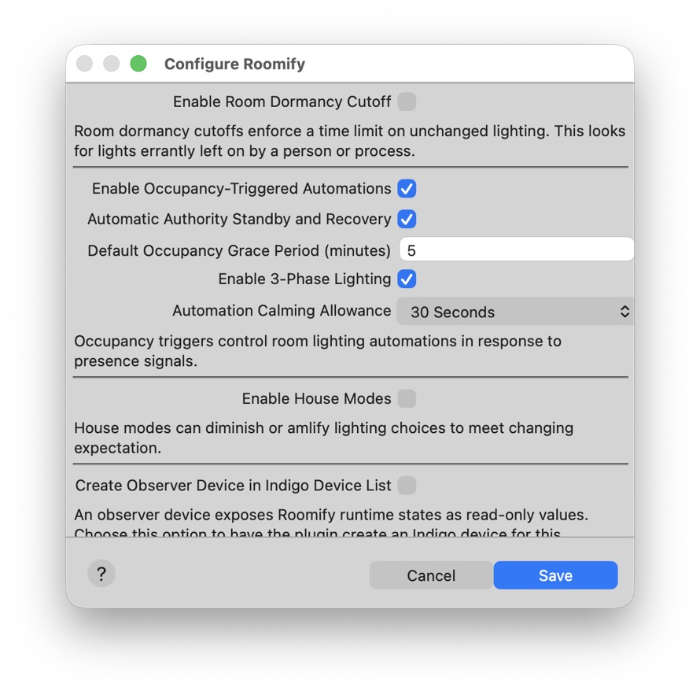
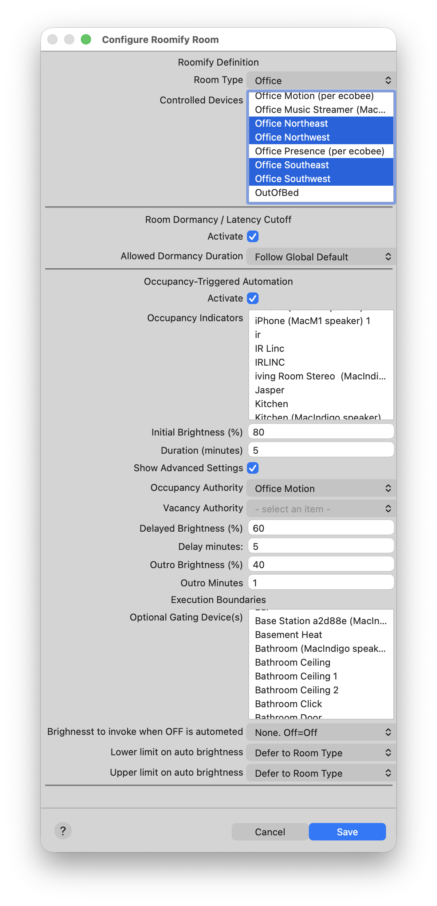
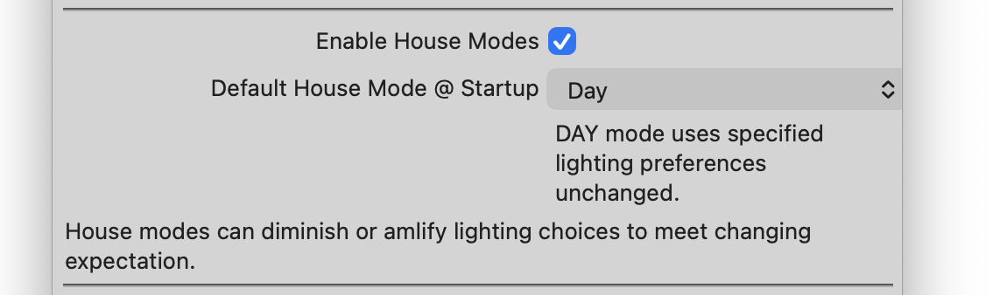

# Advanced Lighting Options

Having rooms that automatically light to our favourite brightness when we arrive is a very nice feature. But in daily life, there are often circumstances where perhaps a brighter or dimmer light would serve better. 

Basic occupancy automation answers two questions:
- Should this room be lit?
- Should this room be vacant?

Advanced Lighting Options answer a different question:
- What lighting is appropriate right now?
  
The features described in this document allow Roomify to adjust lighting based on time, context, occupancy duration, and room type.

## 3-Phase Lighting

Consider how the basic lighting changes when occupied rooms transition into vacancy. One minute the lights are on, the next minute they turn off … executed as if we have certainty that the room is actually vacant. 

Immediately after receiving an occupancy signal, Roomify has high confidence that someone is present. As time passes without additional signals, that confidence naturally decreases. 3-Phase Lighting allows the room lighting to reflect this change in confidence rather than abruptly transitioning from fully lit to completely off.

A better option: execute the lighting in phases, offering the brightest light in the room when occupancy signals are fresh, and reducing that light over time when no additional occupancy signals are presented. In the final minutes, you can reduce the brightness significantly, signalling to anyone nearby that the room is about to be turned off.

By enabling 3-Phase Lighting in the plugin configuration , you can control how room lighting evolves as confidence in continued occupancy decreases.

In the room configuration, you might consider reducing the duration of initial brightness. Roomify will transition to ints second phase - delayed brightness - only after initial duration has passed with no fresh occupancy signals. The duration you select under “delayed brightness” extend the lighting for additional minutes. Likewise the outro minutes, which begin after thee delayed lighting phase. 

NOTE: any fresh occupancy signals processed during this 3-phase cycle return the room to initial occupancy.
  

  

## House Modes

Lets consider for a moment the kitchen. This is a room that is usually brightly lit for meal preparation in the day and evening. But that kind of intense brightness, desirable for meal prep, might not be ideal when grabbing a snack at night or a glass of water in the overnight.

House modes provide a way to address this need. Once enabled in the plugin, you can use Indigo schedules, triggers, action groups, or manual commands to tell Roomify when lighting should be dimmer or brighter than normal.  

  

  
When a House Mode changes, Roomify recalculates the desired lighting for every room. Rooms currently under automation control are immediately adjusted to their new target brightness, while future occupancy events use the same updated calculations.

**IMPORTANT NOTE:** House Modes describe the current state of the home, but Roomify does not determine that state. It never automatically transitions between House Modes or attempts to infer which mode should be active. Instead, you remain in complete control of House Mode selection using Indigo schedules, triggers, action groups, or manual commands. 

**Roomify simply responds to the House Mode currently in effect.**

Because calculated brightness levels may not always be appropriate for every room, Roomify allows you to define execution limits that constrain the lighting it may invoke.

## Execution Limits

For the times when room brightness should be low, but not too low - Roomify respects execution limits.

For the times when room brightness should be high, but not too high - Roomify respects execution limits. 

For the times when a room transitioning to vacancy should still leave a little bit of light - Roomify respects execution limits. 

Roomify includes suggested execution limits based on room type. Stairways, garages, bedrooms, living rooms, and other spaces have different lighting needs, and Roomify uses the selected room type to provide sensible starting values. 

You may find that these default limits per room type suit your needs. If not, you can specify your own limits per room.

They are fairly self explanatory, but here’s a quick overview.  
  
### Brightness To Invoke when Off Is Automated  
With this limiter, you can have Roomify treat a room as unoccupied and OFF, while retaining some light there. You might use it to keep the lights on low in a guest bath or egress route. You might think of it as a nightlight. In most rooms, this will be set to zero. This only applies to lighting changes initiates by Roomify, not to any changes you might invoke otherwise. 

### Lower Limit on Auto Brightness  
This limit applies only to rooms that are meant to be ON, and operates separately from the OFF limiter previously mentioned. It is the lowest brightness Roomify should ever invoke when the room is meant to be lit, even at tits lowest. For safety, I set this to 75 in my stairways and garage. In my bedroom I set to to zero. 

### Upper Limit on Auto Brightness  
This limiter is used less often, but it allows you to prevent Roomify from ever lighting a room above a specified brightness.

## SPECIAL NOTE

House Modes and Execution Limits are built to work together, to always deliver the right lighting in any given place and situation. There’s one particular case for which these modules are ideally suited, and that’s “sleep” mode. 

When the house is in “sleep” mode, every specified target brightness is multiples by a factor of zero, resulting in zero brightness everywhere. This perfectly safeguards the darkness most prefer in sleeping quarters. By setting the lower limit on auto brightness to zero in bedrooms, we can be sure that Roomify won’t disturb the space with unwanted lights during “sleep mode”. By setting every OTHER room with a lower limit of 20-30% (or whatever you prefer), we ALSO can be assured of getting a little light in the overnight whenever we leave the bedroom.