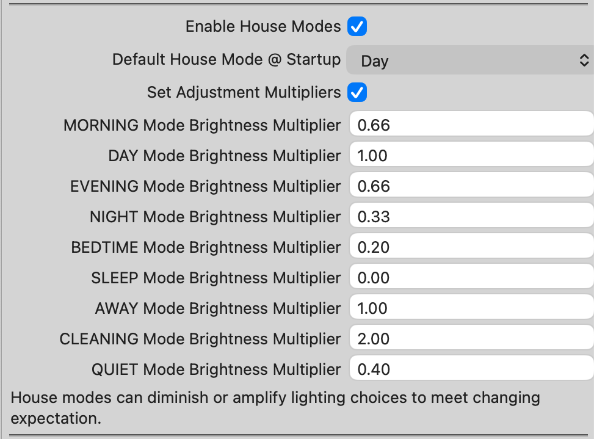

## House Modes

House Modes apply a brightness scaling factor to Roomify's calculated target brightness. These default values are subject to override via the plugin configuration. 

|House Mode|Factor|Effect|
|---|---|---|
|Morning|0.66×|Reduce target brightness to 66% of normal.|
|Day|1.00×|No adjustment.|
|Evening|0.66×|Reduce target brightness to 66% of normal.|
|Night|0.33×|Reduce target brightness to 33% of normal.|
|Quiet|0.40×|Significantly reduce brightness for low-activity periods.|
|Bedtime|0.20×|Very low lighting intended for transition to sleep.|
|Sleep|0.00×|Suppress automatic lighting entirely.|
|Away|1.00×|No brightness adjustment.|
|Cleaning|2.00×|Aggressively increase brightness, subject to room limits.|

> Brightness factors are applied before Room Type floor and ceiling constraints are enforced.

### Brightness Factor Override(s)

The default multipliers listed above reflect my preferences for lighting adjustments appropriate to various circumstances in the home. If you have different prefernces, you can implement them via the Roomify plugin configuration in the **House Modes** section.



Any changes you make here will be immediately applied to rooms that are presently on and automated.

---

## Room Type Presets

Room Types define the allowable brightness range for automated lighting decisions.

|Room Type|Floor|Ceiling|OFF Brightness|Notes|
|---|---|---|---|---|
|Bedroom|0%|100%|0%|Allows full dimming and full brightness.|
|Bathroom|10%|100%|0%|Prevents extremely dim lighting.|
|Closet|50%|100%|0%|Ensures useful illumination for short visits.|
|Dining Room|20%|100%|0%|Balanced for dining and gathering.|
|Garage|75%|100%|0%|Safety-oriented brightness floor.|
|Hallway|50%|100%|0%|Transitional space requiring visibility.|
|Stairway|75%|100%|0%|High minimum brightness for safety.|
|Kitchen|30%|100%|0%|Supports task-oriented lighting.|
|Living Room|20%|100%|0%|General-purpose occupancy profile.|
|Media Room|15%|80%|0%|Reduced maximum brightness for viewing comfort.|
|Office|20%|100%|0%|Suitable for task and productivity lighting.|
|Patio|40%|100%|0%|Outdoor occupancy profile.|
|Utility|20%|80%|0%|Reduced maximum brightness for service areas.|

---

## Brightness Calculation

Roomify computes a target brightness, applies the House Mode factor, and then constrains the result using the Room Type limits.

```text
Calculated Target
        ↓
House Mode Factor Applied
        ↓
Constrained by Room Floor
        ↓
Constrained by Room Ceiling
        ↓
Final Brightness
```

### Example

|Setting|Value|
|---|---|
|Room Type|Stairway|
|Floor|75%|
|Ceiling|100%|
|Calculated Target|40%|
|House Mode|Evening|
|Factor|0.66×|

Calculation:

```text
40% × 0.66 = 26%
```

Because Stairway has a 75% minimum brightness:

```text
Final Brightness = 75%
```

