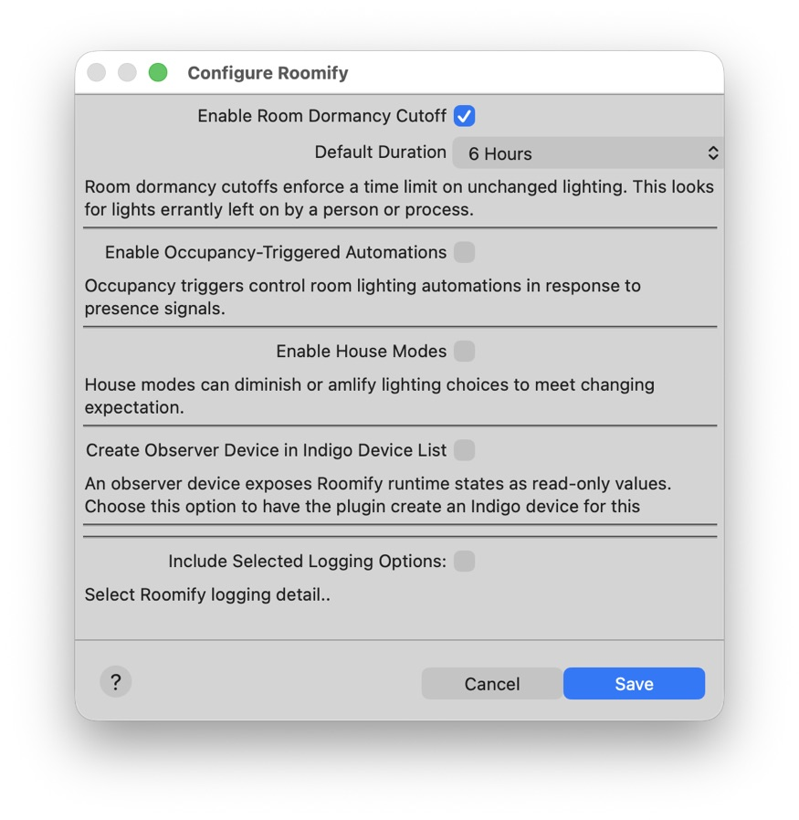
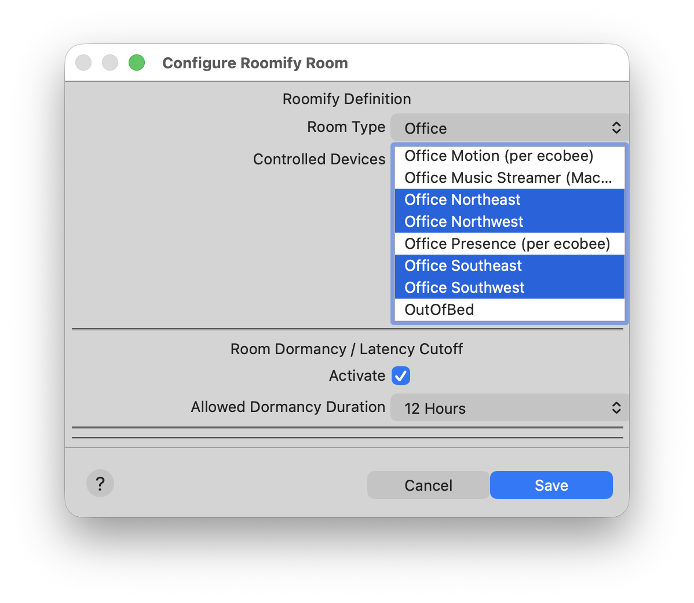

# Room Dormancy Cutoff

Sometimes lights are mistaken left on when they are really meant to be off .. for may possible reasons. People forget. Automations collide. Triggers get disabled. Enter Room Dormancy Cutoff, which automatically turns off rooms that have remained active longer than expected.

This is implemented as a hard cutoff after the time limit you define - up to 24 hours. It isn’t influenced by occupancy signals in any way. The transition from ON to OFF is gradual (where possible), but the decision to turn lights off is definitive. 

It helps ensure that lights aren’t mistakenly forgotten by people or automations and left on indefinitely. 

Rooms can be configured to follow this dormancy policy by simply activating the feature in the room configuration. Further, each room can be set up with its own time limit as appropriate to that particular room.

## Step 1: Enable in the Plugin Config 

Just check the box and select the maximum on time you prefer for most room.

**Plugins → Roomify → Configure**

## Step 2: Activate in Target Room(s)

Now, for any room you want Roomify to monitor and turn off after your specified maximum time period has elapsed, go in to the room config and make those selections. You can choose to  have a room follow the duration specified in the plugin configuration, or assign a different maximum time to any room you like.
  

## Done

Roomify will begin monitoring the room upon next activation, standing by to turn forgotten lights off.

## See Also:

[Basic Occupancy Automation](Basic%20Occupancy%20Automation.md)